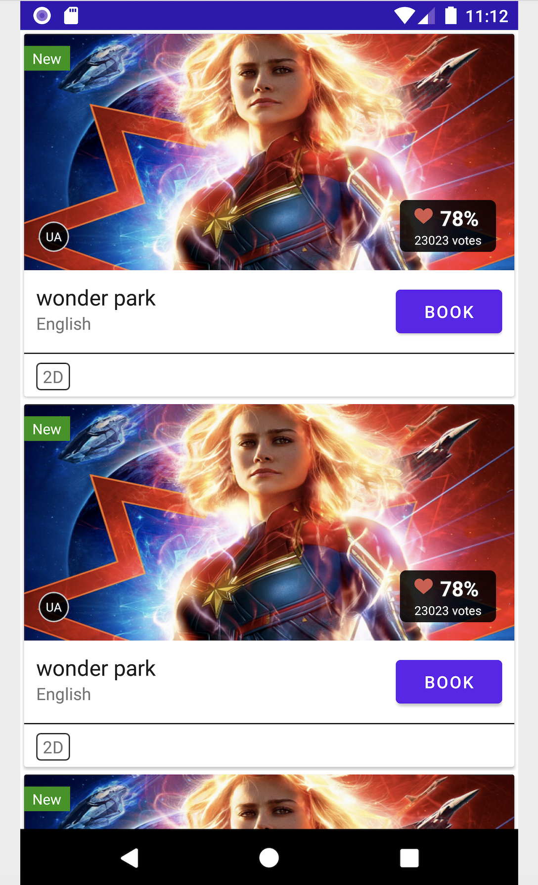

# RecyclerView-with-MVVM
Do you want to learn the MVVM way of making a RecyclerView?  I have created a demo here using RecyclerView by fetching Data from an API. I have followed the MVVM Architecture. 

